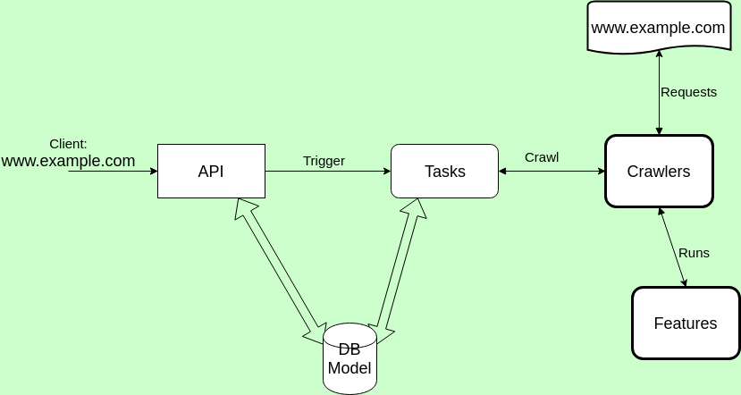

# infolabs


## Diagram
See 

## Models

Report/DomainCheck:
 * domain = CharField()
 * state = [CharField](https://docs.djangoproject.com/en/1.11/ref/models/fields/#django.db.models.Field.choices)(choices=REPORT_STATES)
 * created_at = [DateTimeFied](https://docs.djangoproject.com/en/1.11/ref/models/fields/#django.db.models.DateTimeField)
 
Feature:
 * name = CharField()
 * value = [JsonField](https://github.com/dmkoch/django-jsonfield)()
 * compare_value = JsonField()
 * report = [ForeignKey](https://docs.djangoproject.com/en/1.11/ref/models/fields/#django.db.models.ForeignKey)()
For feature the `name` and `report` should be [unique together](https://docs.djangoproject.com/en/1.11/ref/models/options/#unique-together).
 
```python
REPORT_STATES = [
  ('pending', 'pending'),
  ('finished', 'finished')
]
```

## API
You can find the blueprint in `docs/bluepring.html`.
To build the blueprint install [aglio](https://github.com/danielgtaylor/aglio) and run `aglio -i blueprint.md -o blueprint.html`
